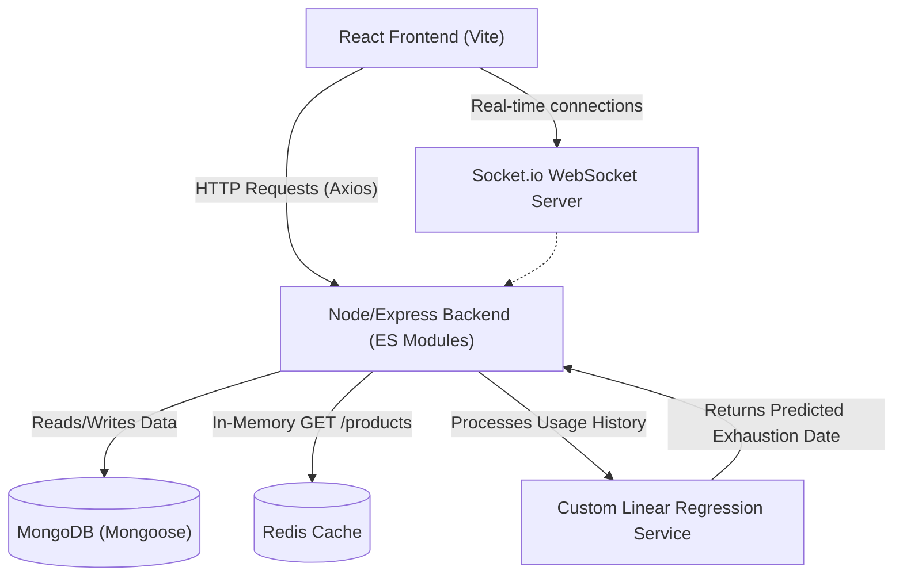

# StockSense AI — Intelligent Inventory Management

**StockSense AI** is a Master's level MERN-stack application leveraging Custom Linear Regression and Real-Time WebSockets for intelligent inventory administration and predictive exhaustion analytics.

## Tech Stack
- **Frontend**: React (Vite), TailwindCSS, Axios, Recharts, Socket.io-client.
- **Backend (ES Modules)**: Node.js, Express, MongoDB (Mongoose), JWT Auth.
- **AI/ML Logic**: Custom Linear Regression (`forecastService.js`).
- **DevOps**: Docker, Docker Compose, GitHub Actions (CI/CD).
- **Caching**: Redis.

## Architecture



## Features
- **JWT Authentication**: User login and protective routes logic.
- **Product Management (CRUD + Advanced)**: Allows creating stock records spanning SKU logic. Maintains detailed arrays denoting exact temporal increments of `usageHistory`.
- **Mandatory AI Engine**: Integrates algorithm to extract OLS linear estimates mapping out explicit exhaustion bounds, calculating dynamic "Predicted Exhaustion Date".
- **Real-Time Data Distribution**: Stock updates or CRUD commands are immediately broadcast via binary payloads via `inventoryUpdate` using Socket.io protocols minimizing client resync issues. 
- **Redis Content Delivery**: Accelerated reads through a custom caching middleware on the `GET /api/products` route drastically reducing MongoDB queries.

## Development Setup

### 1. Prerequisites
- [Node.js](https://nodejs.org/) (v18+)
- [Docker & Docker Compose](https://www.docker.com/)

### 2. Running Locally with Docker
Create an `.env` file in `./server` ensuring `MONGO_URI` maps to `mongodb://mongo:27017/stocksense` and `REDIS_HOST=redis`.
```bash
docker-compose up --build
```
The Frontend will be exposed on port `80`, and the Node backend on `5000`.

### 3. Local Startup without Docker
Ensure MongoDB and Redis are running locally. 
```bash
# Terminal 1 - Backend
cd server
npm install
npm test # To Verify custom Linear Regression model
npm start

# Terminal 2 - Frontend
cd client
npm install
npm run dev
```

## Version Control & Commit Strategy
This repository relies tightly on the **Conventional Commits** standard utilizing a `main` and `dev` branch architecture strategy. 

Please abide by the following prefixes for robust PR generation syntax:
- `feat:` for adding structural or new logic features.
- `fix:` for fixing syntax, routing, or database glitches.
- `perf:` for implementations dealing broadly with Redis caching speedups or refactoring Linear Regression execution times.

**Example**: `feat: implement realtime stock update websockets on Dashboard.jsx`

## Author
Developed as a comprehensive Master's level architecture proving robust full-stack deployment skills coupled natively with fundamental data science processing.
